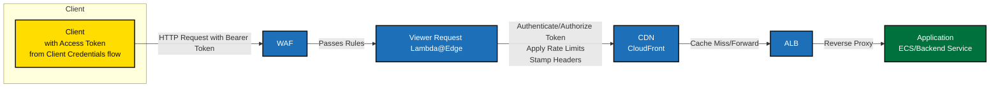

# trade-tariff-lambdas-authenticator

Authenticates, authorizes and rate limits requests to various Tariff APIs.

Lambda function that authenticates at the edge of our main cloudfront distribution during Viewer Request.



## Deployments

> You will need to have the Serverless Framework installed and configured with appropriate AWS credentials loaded into your environment.

The Lambda function is deployed using serverless framework.

To deploy the function, run the following command in the project root directory:

```bash
# Deploy the Lambda function to the development stage (usually in the development account)
DEPLOYMENT_BUCKET=<bucket> STAGE=development serverless deploy
```

> [!NOTE]
> Each AWS account should have its own deployment bucket and deploys to a stage corresponding to the environment (e.g., development, staging, production).

If you want to inspect the contents of the deployment package without deploying, you can run:

```bash
# Create the deployment package
serverless package
# This will create a `.serverless` directory containing the deployment package.
vim .serverless/viewer-request.zip.zip
```

> [!IMPORTANT]
> After deployment has complete a version will need to be published and associated with the CloudFront distribution. This entire process can take as much as 1 hour to finish

You can publish a new version of the Lambda function using the following command:

```bash
.github/bin/publish-version
```

This script will make sure to create a new version of the Lambda function and output the version ARN which will be picked up by the cloudfront distribution.
